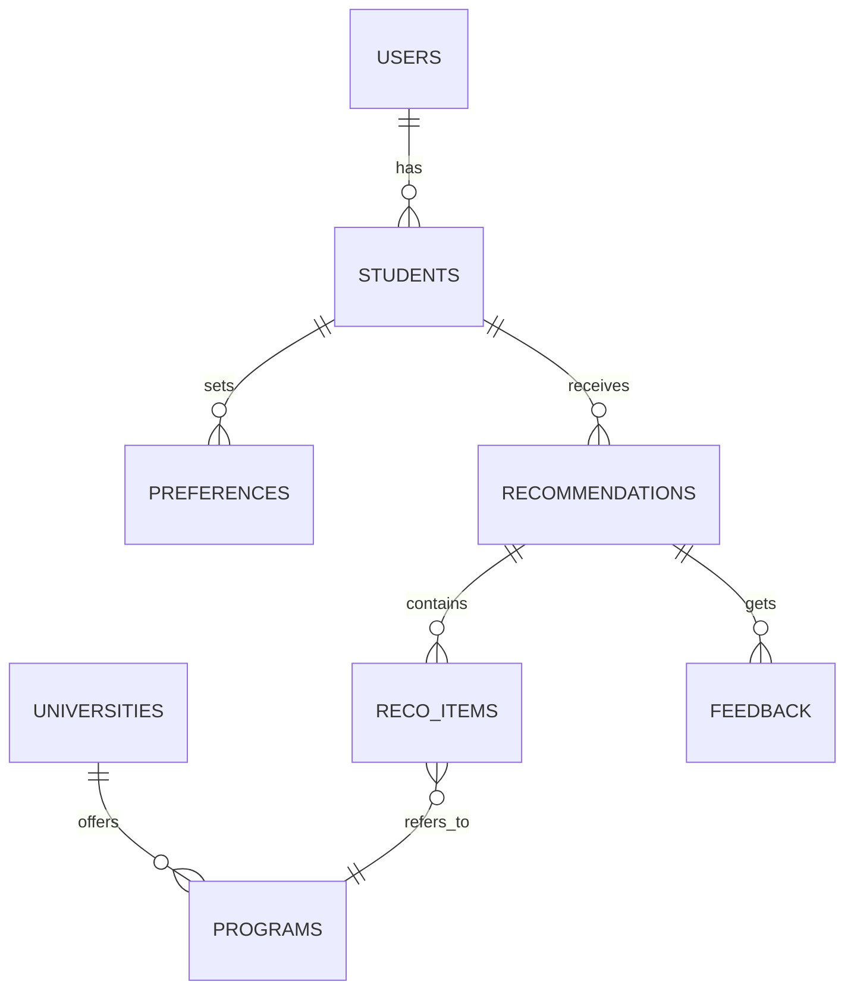
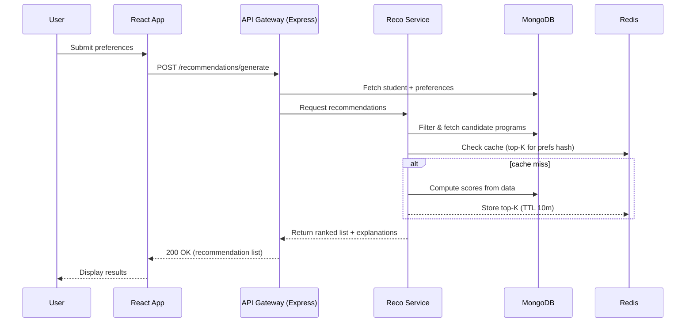
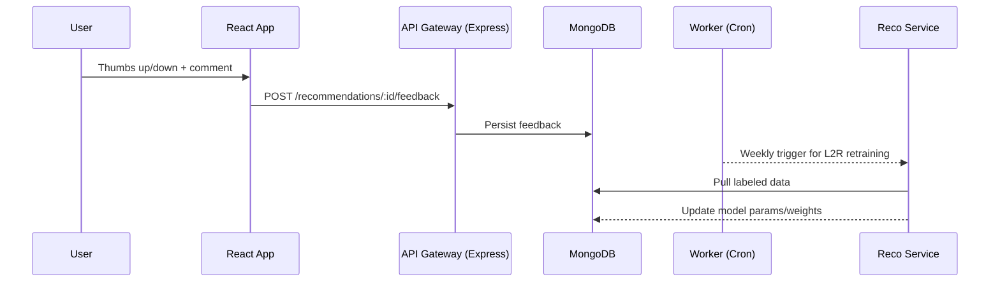
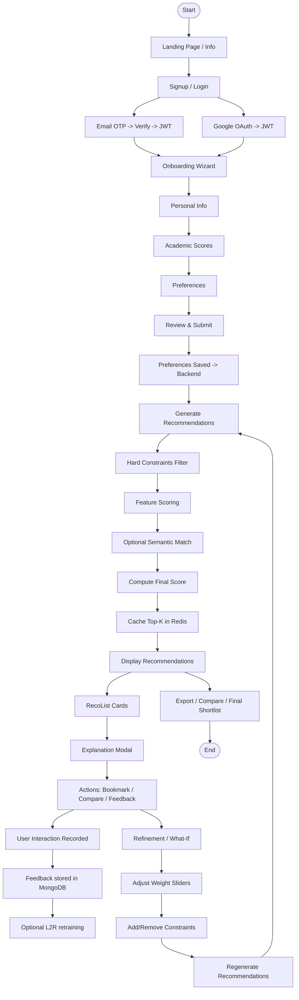

# AI Counsellor — Low-Level Design (LLD)

**Version**: 1.0  
**Team**: 5  
**Date**: 19/08/2025  

---

## 1) Context & Goals  

**Problem:**  
Students finishing Grade 12 struggle to map their interests, eligibility, and constraints to suitable universities/programs in India and abroad.  

**Goal:** Build a web app that:  
- Ranks and explains best-fit programs  
- Allows iterative preference refinement  
- Produces actionable shortlists with application checklists  

**Primary KPIs:**  
- TTFReco ≤ 10s (p95)  
- Recommendation acceptance ≥ 60%  
- Satisfaction (thumbs-up on explanation) ≥ 80%  

---

## 2) Core Use Cases  

1. **Onboarding & Preference Capture:**  
   Student signs up, enters academics, entrance scores, constraints, and goals.  

2. **Get Recommendations:**  
   Return ranked universities/programs with eligibility check, predicted admit likelihood, costs, and explanations.  

3. **Refine & What-If:**  
   Tweak weights (fees, distance, ranking, placements), add hard constraints, rerun recommendations.  

4. **Bookmark & Compare:**  
   Save shortlists, side-by-side comparison, export PDF.  

5. **Feedback Loop:**  
   Thumbs up/down; collect labels to improve ranking.  

---

## 3) High-Level Architecture  

**Stack:**  
- **Frontend:** React.js + JavaScript + Tailwind CSS  
- **Backend:** Node.js + Express  
- **Database:** MongoDB Atlas  
- **Cache:** Redis  
- **Storage:** S3-compatible (Cloudflare R2 / AWS S3)  
- **Auth:** JWT + Email OTP / Google OAuth  
- **Deployment:** Frontend → Vercel/Netlify, Backend → Render  

**Diagram (Mermaid):**  

```mermaid
flowchart LR
    subgraph Client
        A[React Frontend (CRA)]
    end

    subgraph Platform
        B[API Gateway
Node.js + Express]
        C[Reco Service]
        D[(MongoDB Atlas)]
        E[(Redis Cache)]
        F[(S3 / Cloud Storage)]
    end

    A -- HTTPS --> B
    B --> C
    B --> D
    B --> E
    C --> D
    C --> E
    C --> F
```

---

## 4) Data Model (MongoDB Collections)  

**users**  
```json
{ "_id": ObjectId, "email": "string", "auth_provider": "email/google", "created_at": ISODate }
```  

**students**  
```json
{ "_id": ObjectId, "user_id": ObjectId, "full_name": "string", "board": "CBSE/ICSE/State/IB", "twelfth_stream": "PCM/PCB/Commerce/Arts", "twelfth_percentage": 95.2, "entrance_scores": {"JEE_Main":92.4,"CUET":650}, "location_home":{"city":"Bangalore","state":"KA","lat":12.97,"lng":77.59}, "created_at": ISODate }
```  

**preferences**  
```json
{ "_id": ObjectId, "student_id": ObjectId, "budget_max": 200000, "distance_km_max": 500, "preferred_locations": ["Delhi","Bangalore"], "preferred_disciplines": ["CSE","ECE","Design"], "hard_constraints": {"NAAC":"A+","Hostel":true}, "weightage":{"fees":0.3,"ranking":0.25,"placements":0.25,"distance":0.2}, "created_at": ISODate }
```  

**universities**  
```json
{ "_id": ObjectId, "name": "XYZ University", "city":"Mumbai","state":"MH", "lat":19.07,"lng":72.87, "accreditation":"NAAC A+", "ranking":{"NIRF_2024":51}, "website":"https://xyz.edu", "features":{"hostel":true,"scholarships":true}, "created_at": ISODate }
```  

**programs**  
```json
{ "_id": ObjectId, "university_id": ObjectId, "name":"B.Tech CSE", "discipline":"CSE", "duration_years":4, "annual_fee_inr":150000, "intake":120, "entrance_required":["JEE","CUET"], "min_eligibility":{"twelfth_min_pct":60,"subjects":["Maths"]}, "placements":{"median_ctc_lpa":7.2,"avg_ctc_lpa":9.5}, "last_year_cutoff":{"JEE_Main_percentile":88.0}, "brochure_url":"https://xyz.edu/brochure.pdf", "created_at": ISODate }
```  

**recommendations**  
```json
{ "_id": ObjectId, "student_id": ObjectId, "preferences_id": ObjectId, "items":[ {"program_id":ObjectId,"score":0.85,"factors":{},"explanation":"..."} ], "generated_at": ISODate }
```  

**feedback**  
```json
{ "_id": ObjectId, "recommendation_id": ObjectId, "item_program_id": ObjectId, "label": 1, "comment": "string", "created_at": ISODate }
```  

**Entity Relationships (Mermaid):**  


---

## 5) API Design (Express.js)  

**Base URL:** `/api/v1`  

- **Auth**  
  - `POST /auth/signup` → { email } → OTP  
  - `POST /auth/verify` → { email, otp } → { access_token, user }  

- **Students & Preferences**  
  - `GET /students/me` → fetch profile  
  - `PUT /students/me` → update profile  
  - `POST /preferences` → create  
  - `GET /preferences/:id` → fetch  

- **Recommendations**  
  - `POST /recommendations/generate` → generate recommendations  
  - `POST /recommendations/:id/feedback` → submit feedback  

- **Programs & Search**  
  - `GET /programs/:id` → program details  
  - `GET /search?q=&filters=` → hybrid search  
  - `GET /compare?program_ids=a,b,c` → comparison  

- **Admin / Ingestion**  
  - `POST /admin/ingest/universities` → bulk insert  
  - `POST /admin/ingest/programs` → bulk insert  

**Error Contract:**  
```json
{ "error": { "code":"string", "message":"string" } }
```  

---

## 6) Recommendation Engine  

**Pipeline:**  
1. Filter programs by hard constraints + eligibility  
2. Compute feature scores: fees, ranking, placements, distance  
3. Optional: semantic similarity via embeddings  
4. Hybrid score = weighted sum × eligibility gate  
5. Return top-K with explanation  

**Caching:** Redis (top-K per student + preference hash, TTL 10 min)  

**Scoring (Pseudo):**  
```text
score(program, prefs) = gate(eligibility) * (
    w_fees * normalize(1/annual_fee) +
    w_ranking * normalize(-nirf_rank) +
    w_placements * normalize(median_ctc_lpa) +
    w_distance * normalize(-distance_km)
)
```

---

## 7) Frontend Components (React)  
- OnboardingWizard → multi-step form  
- PreferenceSliderGroup → adjust weights  
- RecoList → virtualized list  
- ProgramCompare → comparison grid  
- ExplanationModal → factor breakdown  
- FeedbackBar → thumbs up/down + comment  
- AuthModal → OTP / Google OAuth  

**State Management:** React Query or Redux  

---

## 8) Non-Functional Requirements  
- Performance: API p95 < 700ms, Reco ≤ 2.5s  
- Reliability: <0.5% errors, partial fallback  
- Scalability: stateless, auto-scale, Mongo read replicas  
- Security: JWT, OWASP, input validation, rate-limit 60 rpm  
- Privacy: PII encrypted at rest, TLS in transit  
- Observability: Logs (Winston), metrics (Prometheus), traces (OpenTelemetry)  

---

## 9) Sequence Diagrams  

### Generate Recommendation (Mermaid)  


### Feedback (Mermaid)  


---

## 10) Deployment  
- Frontend: React CRA → Vercel / Netlify  
- Backend API: Express.js → Render  
- Database: MongoDB Atlas  
- Cache: Redis  
- Storage: S3-compatible (Cloudflare R2 / AWS S3)  

---

## 11) User Flow Diagram (Mermaid)  



---

*This document contains the complete LLD with full diagrams embedded using Mermaid for easy rendering on GitHub and other Markdown viewers that support Mermaid.*
